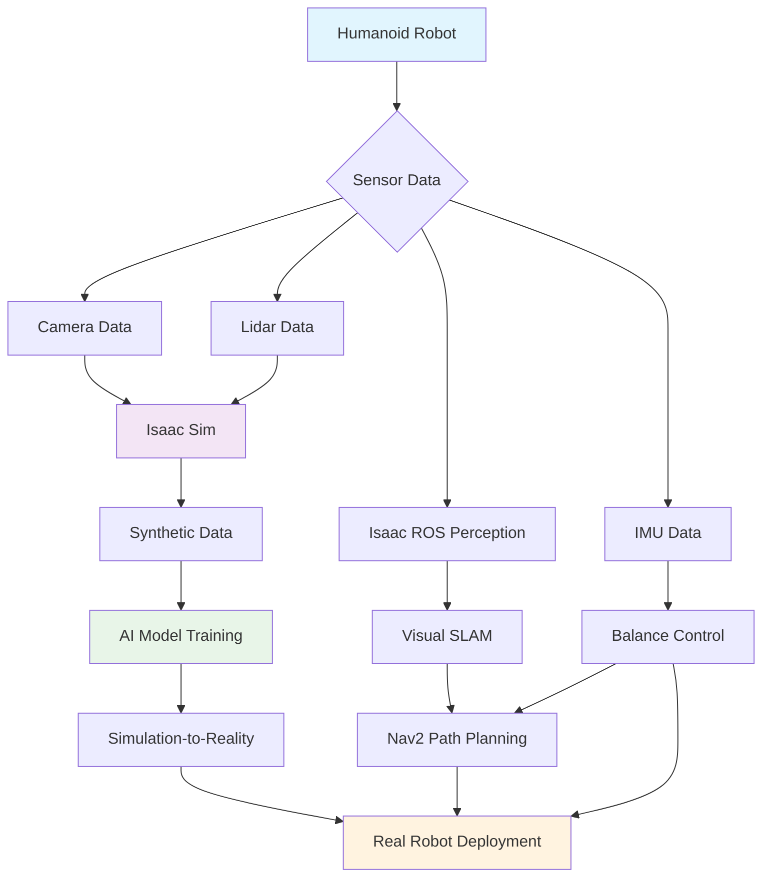

# Complete AI-Robot Brain Project Example

## Overview
This chapter presents a comprehensive end-to-end example that integrates all components of the Isaac ecosystem: Isaac Sim for simulation and synthetic data generation, Isaac ROS for perception and navigation, and Nav2 for path planning. The example demonstrates a complete AI-powered humanoid robot system from simulation to real-world deployment.

## Project Architecture

### System Overview
The complete AI-Robot Brain system consists of:

1. **Isaac Sim** - For photorealistic simulation and synthetic data generation
2. **Isaac ROS** - For hardware-accelerated perception and navigation
3. **Nav2** - For advanced path planning adapted for bipedal humanoid robots
4. **AI Training Pipeline** - For developing perception and control models
5. **Simulation-to-Reality Transfer** - For deploying simulation-trained models to real robots

### Component Integration Architecture



## Complete Project Implementation

### 1. Isaac Sim Configuration

#### Environment Setup
Create a comprehensive simulation environment:

```python
# complete_project_sim.py
import omni
from omni.isaac.core import World
from omni.isaac.core.utils.nucleus import get_assets_root_path
from omni.isaac.core.utils.stage import add_reference_to_stage
from omni.isaac.core.utils.prims import get_prim_at_path
from omni.isaac.sensor import Camera
import numpy as np
import carb

class CompleteProjectSim:
    def __init__(self):
        self.world = World(stage_units_in_meters=1.0)
        self.setup_environment()
        self.setup_robot()
        self.setup_sensors()
        self.setup_ai_training_environment()

    def setup_environment(self):
        """Setup the complete simulation environment"""
        # Add realistic office environment
        assets_root_path = get_assets_root_path()
        if assets_root_path is None:
            carb.log_error("Could not find Isaac Sim assets path")
            return

        # Add office scene
        office_path = assets_root_path + "/Isaac/Environments/Simple_Room/simple_room.usd"
        add_reference_to_stage(office_path, "/World/Office")

        # Add dynamic obstacles
        self.add_dynamic_obstacles()

        # Configure realistic lighting
        self.configure_lighting()

    def setup_robot(self):
        """Setup the humanoid robot model"""
        # Load humanoid robot from assets
        robot_asset_path = assets_root_path + "/Isaac/Robots/Humanoid/humanoid_instanceable.usd"
        self.robot = self.world.scene.add(
            PrimPath="/World/Robot",
            prim_type="Xform",
            usd_path=robot_asset_path,
            position=np.array([0.0, 0.0, 0.5]),
            orientation=np.array([1.0, 0.0, 0.0, 0.0])
        )

    def setup_sensors(self):
        """Setup all required sensors for the robot"""
        # Add RGB camera
        self.camera = Camera(
            prim_path="/World/Robot/Camera",
            frequency=30,
            resolution=(640, 480)
        )

        # Add depth camera
        self.depth_camera = Camera(
            prim_path="/World/Robot/DepthCamera",
            frequency=30,
            resolution=(640, 480),
            sensor_type="depth"
        )

        # Add IMU
        self.imu = self.world.scene.add(
            IMU(
                prim_path="/World/Robot/IMU",
                name="robot_imu"
            )
        )

    def setup_ai_training_environment(self):
        """Setup environment for AI training with domain randomization"""
        self.setup_domain_randomization()
        self.setup_training_scenarios()

    def setup_domain_randomization(self):
        """Setup domain randomization for robust AI training"""
        # Randomize lighting conditions
        self.light_randomizer = {
            'intensity_range': (100, 1000),
            'color_temperature_range': (3000, 8000),
            'position_range': ((-5, -5, 5), (5, 5, 10))
        }

        # Randomize material properties
        self.material_randomizer = {
            'roughness_range': (0.1, 0.9),
            'metallic_range': (0.0, 0.5),
            'color_range': ((0, 0, 0), (1, 1, 1))
        }

    def setup_training_scenarios(self):
        """Setup various training scenarios"""
        self.scenarios = [
            "office_navigation",
            "obstacle_avoidance",
            "balance_maintenance",
            "object_interaction"
        ]

    def run_training_episode(self, scenario_name):
        """Run a complete training episode for the given scenario"""
        # Reset environment for the scenario
        self.reset_scenario(scenario_name)

        # Initialize episode variables
        episode_reward = 0
        done = False
        step_count = 0

        while not done and step_count < 1000:  # Max 1000 steps per episode
            # Get current observations
            obs = self.get_observations()

            # Get action from AI policy
            action = self.get_action(obs)

            # Execute action in simulation
            reward, done, info = self.execute_action(action)

            # Store experience for training
            self.store_experience(obs, action, reward, done)

            episode_reward += reward
            step_count += 1

            # Step the simulation
            self.world.step(render=True)

        return episode_reward

    def get_observations(self):
        """Get observations from all sensors"""
        obs = {}

        # Camera observations
        rgb_image = self.camera.get_rgb()
        depth_image = self.depth_camera.get_depth()

        # IMU observations
        imu_data = self.imu.get_measured_value()

        # Robot state observations
        robot_position = self.robot.get_world_pos()
        robot_orientation = self.robot.get_world_quat()
        robot_joints = self.robot.get_joints_state()

        obs.update({
            'rgb_image': rgb_image,
            'depth_image': depth_image,
            'imu_data': imu_data,
            'position': robot_position,
            'orientation': robot_orientation,
            'joints': robot_joints
        })

        return obs

    def get_action(self, obs):
        """Get action from AI policy based on observations"""
        # This would typically call a neural network policy
        # For this example, we'll return a dummy action
        return np.random.uniform(-1, 1, size=(10,))  # 10-dof action space

    def execute_action(self, action):
        """Execute action in simulation and return reward, done, info"""
        # Apply action to robot joints
        self.robot.apply_action(action)

        # Calculate reward based on task
        reward = self.calculate_reward()

        # Check if episode is done
        done = self.check_episode_done()

        # Get additional info
        info = self.get_episode_info()

        return reward, done, info

    def calculate_reward(self):
        """Calculate reward for current state"""
        # Example reward calculation
        # In practice, this would be task-specific
        return 0.0

    def check_episode_done(self):
        """Check if episode is done"""
        # Example termination condition
        return False

    def get_episode_info(self):
        """Get additional episode information"""
        return {}

    def reset_scenario(self, scenario_name):
        """Reset simulation for the given scenario"""
        # Reset robot position and state
        self.robot.set_world_pos(np.array([0.0, 0.0, 0.5]))
        self.robot.set_world_quat(np.array([1.0, 0.0, 0.0, 0.0]))

        # Reset environment objects based on scenario
        if scenario_name == "office_navigation":
            self.setup_office_navigation_scenario()
        elif scenario_name == "obstacle_avoidance":
            self.setup_obstacle_avoidance_scenario()
        # Add more scenarios as needed

    def setup_office_navigation_scenario(self):
        """Setup office navigation scenario"""
        # Place goal in the environment
        self.goal_position = np.array([5.0, 5.0, 0.0])

        # Add office furniture and obstacles
        self.add_office_furniture()

    def setup_obstacle_avoidance_scenario(self):
        """Setup obstacle avoidance scenario"""
        # Place obstacles in the environment
        self.place_dynamic_obstacles()

    def store_experience(self, obs, action, reward, done):
        """Store experience for AI training"""
        # Store in replay buffer or dataset
        experience = {
            'obs': obs,
            'action': action,
            'reward': reward,
            'done': done
        }
        # Add to training dataset
        self.add_to_training_data(experience)

    def add_to_training_data(self, experience):
        """Add experience to training dataset"""
        # In practice, this would add to a replay buffer or dataset
        pass
```

### 2. Isaac ROS Integration

#### Perception Pipeline Configuration
Create the complete Isaac ROS perception pipeline:

```yaml
# complete_project_perception.yaml
camera_preprocessor:
  ros__parameters:
    input_width: 640
    input_height: 480
    flip_image: false
    normalized_coordinates: false
    output_image_encoding: "rgb8"

isaac_ros_visual_slam:
  ros__parameters:
    enable_rectified_pose: True
    enable_fisheye_distortion: False
    rectified_frame: "camera_color_optical_frame"
    map_frame: "map"
    odometry_frame: "odom"
    base_frame: "base_link"
    imu_frame: "imu_link"
    debug_imu: false
    publish_tf: true
    publish_debug_data: false
    enable_observations_display: true
    enable_slam_visualization: true
    enable_localization_n_mapping: true
    enable_point_cloud_output: true
    use_sim_time: true

    # Hardware acceleration
    enable_gpu_acceleration: true
    image_buffer_size: 1
    num_frames_batch_size: 1

    # Feature tracking parameters
    num_features: 1000
    num_keyframes: 100
    min_num_keyframes: 50
    max_num_keyframes: 200

    # Loop closure parameters
    enable_loop_detection: true
    loop_detection_frequency: 1.0
    min_loop_detection_interval: 30.0
    loop_detection_threshold: 0.3

    # Map management
    map_package_path: "package://complete_project/maps/default_map.slamtoolbox"

depth_preprocessor:
  ros__parameters:
    width: 640
    height: 480
    depth_unit: "METER"
    enable_padding: false

isaac_ros_stereo_image_proc:
  ros__parameters:
    alpha: 0.0
    use_interactive_parameter_resolution: false
    fisheye: false
    use_sim_time: true

isaac_ros_h264_decoder:
  ros__parameters:
    input_width: 1920
    input_height: 1080
    output_format: "bgr8"
    use_sim_time: true

isaac_ros_manipulator:
  ros__parameters:
    joint_names: ["joint1", "joint2", "joint3", "joint4", "joint5", "joint6"]
    joint_limits:
      min: [-2.0, -2.0, -2.0, -2.0, -2.0, -2.0]
      max: [2.0, 2.0, 2.0, 2.0, 2.0, 2.0]
    control_frequency: 100.0
    use_sim_time: true
```

#### Perception Launch File
Create a complete launch file for the perception pipeline:

```python
# complete_project_perception_launch.py
import launch
from launch_ros.actions import ComposableNodeContainer
from launch_ros.descriptions import ComposableNode
from launch.actions import DeclareLaunchArgument
from launch.substitutions import LaunchConfiguration
from ament_index_python.packages import get_package_share_directory
import os

def generate_launch_description():
    # Declare launch arguments
    params_file = LaunchConfiguration('params_file')
    use_sim_time = LaunchConfiguration('use_sim_time')

    # Declare launch arguments
    declare_params_file = DeclareLaunchArgument(
        'params_file',
        default_value=os.path.join(
            get_package_share_directory('complete_project'),
            'config',
            'complete_project_perception.yaml'
        ),
        description='Path to parameters file'
    )

    declare_use_sim_time = DeclareLaunchArgument(
        'use_sim_time',
        default_value='true',
        description='Use simulation time'
    )

    # Create container for perception nodes
    perception_container = ComposableNodeContainer(
        name='perception_container',
        namespace='',
        package='rclcpp_components',
        executable='component_container_mt',
        composable_node_descriptions=[
            # Camera preprocessing
            ComposableNode(
                package='isaac_ros_image_proc',
                plugin='nvidia::isaac_ros::image_proc::RectifyNode',
                name='camera_rectify',
                parameters=[params_file]
            ),

            # Visual SLAM
            ComposableNode(
                package='isaac_ros_visual_slam',
                plugin='nvidia::isaac_ros::visual_slam::VisualSlamNode',
                name='visual_slam',
                parameters=[params_file],
                remappings=[('visual_slam/imu', '/imu/data'),
                           ('visual_slam/camera', '/camera/rgb/image_rect_color')]
            ),

            # Depth preprocessing
            ComposableNode(
                package='isaac_ros_depth_preprocessor',
                plugin='nvidia::isaac_ros::depth_preprocessor::DepthProcessorNode',
                name='depth_preprocessor',
                parameters=[params_file]
            ),

            # Stereo processing
            ComposableNode(
                package='isaac_ros_stereo_image_proc',
                plugin='nvidia::isaac_ros::stereo_image_proc::DisparityNode',
                name='disparity_node',
                parameters=[params_file]
            )
        ],
        output='screen'
    )

    return launch.LaunchDescription([
        declare_params_file,
        declare_use_sim_time,
        perception_container
    ])
```

### 3. Nav2 Configuration for Humanoid Robot

#### Complete Nav2 Configuration
Create the complete Nav2 configuration for the humanoid robot:

```yaml
# complete_project_nav2.yaml
amcl:
  ros__parameters:
    use_sim_time: True
    alpha1: 0.2
    alpha2: 0.2
    alpha3: 0.2
    alpha4: 0.2
    alpha5: 0.2
    base_frame_id: "base_footprint"
    beam_skip_distance: 0.5
    beam_skip_error_threshold: 0.9
    beam_skip_threshold: 0.3
    do_beamskip: False
    global_frame_id: "map"
    lambda_short: 0.1
    laser_likelihood_max_dist: 2.0
    laser_max_range: 100.0
    laser_min_range: -1.0
    max_beams: 60
    max_particles: 2000
    min_particles: 500
    odom_frame_id: "odom"
    pf_err: 0.05
    pf_z: 0.99
    recovery_alpha_fast: 0.0
    recovery_alpha_slow: 0.0
    resample_interval: 1
    robot_model_type: "nav2_amcl::DifferentialMotionModel"
    save_pose_rate: 0.5
    sigma_hit: 0.2
    tf_broadcast: True
    transform_tolerance: 1.0
    update_min_a: 0.2
    update_min_d: 0.25
    z_hit: 0.5
    z_max: 0.05
    z_rand: 0.5
    z_short: 0.05

bt_navigator:
  ros__parameters:
    use_sim_time: True
    global_frame: map
    robot_base_frame: base_footprint
    odom_topic: /odom
    default_bt_xml_filename: "complete_project_navigator.xml"
    plugin_lib_names:
    - nav2_compute_path_to_pose_action_bt_node
    - nav2_follow_path_action_bt_node
    - nav2_back_up_action_bt_node
    - nav2_spin_action_bt_node
    - nav2_wait_action_bt_node
    - nav2_clear_costmap_service_bt_node
    - nav2_is_stuck_condition_bt_node
    - nav2_goal_reached_condition_bt_node
    - nav2_goal_updated_condition_bt_node
    - nav2_initial_pose_received_condition_bt_node
    - nav2_reinitialize_global_localization_service_bt_node
    - nav2_rate_controller_bt_node
    - nav2_distance_controller_bt_node
    - nav2_speed_controller_bt_node
    - nav2_truncate_path_action_bt_node
    - nav2_goal_updater_node_bt_node
    - nav2_recovery_node_bt_node
    - nav2_pipeline_sequence_bt_node
    - nav2_round_robin_node_bt_node
    - nav2_transform_available_condition_bt_node
    - nav2_time_expired_condition_bt_node
    - nav2_path_expiring_timer_condition
    - nav2_distance_traveled_condition_bt_node
    - nav2_single_trigger_bt_node
    - nav2_is_battery_low_condition_bt_node
    - nav2_navigate_through_poses_action_bt_node
    - nav2_navigate_to_pose_action_bt_node
    - nav2_remove_passed_goals_action_bt_node
    - nav2_planner_selector_bt_node
    - nav2_controller_selector_bt_node
    - nav2_goal_checker_selector_bt_node
    - nav2_controller_cancel_bt_node
    - nav2_path_longer_on_approach_bt_node
    - nav2_wait_on_matrix_size_bt_node
    - nav2_compute_path_through_poses_action_bt_node

controller_server:
  ros__parameters:
    use_sim_time: True
    controller_frequency: 10.0
    min_x_velocity_threshold: 0.05
    min_y_velocity_threshold: 0.05
    min_theta_velocity_threshold: 0.05
    progress_checker_plugin: "progress_checker"
    goal_checker_plugin: "humanoid_goal_checker"
    controller_plugins: ["FollowPath"]

    # Humanoid-specific controller
    FollowPath:
      plugin: "nav2_mppi_controller::MPPIController"
      time_steps: 25
      model_dt: 0.05
      batch_size: 1000
      vx_std: 0.2
      vy_std: 0.05
      wz_std: 0.3
      vx_max: 0.5
      vx_min: -0.1
      vy_max: 0.1
      vy_min: -0.1
      wz_max: 0.3
      wz_min: -0.3
      iteration_count: 3
      motion_model: "DiffDrive"
      xy_goal_tolerance: 0.5  # Larger tolerance for bipedal stability
      yaw_goal_tolerance: 0.2
      stateful: True
      transform_tolerance: 0.3
      goal_reached_tol: 0.25
      path_tolerance: 0.1
      reference_speed: 0.2
      # Humanoid-specific parameters
      balance_weight: 10.0
      step_constraint_weight: 5.0

local_costmap:
  ros__parameters:
    use_sim_time: True
    global_frame: odom
    robot_base_frame: base_footprint
    update_frequency: 10.0
    publish_frequency: 5.0
    static_map: False
    rolling_window: True
    width: 10
    height: 10
    resolution: 0.025  # Higher resolution for precise planning
    robot_type: "bipedal"
    robot_radius: 0.4  # Effective radius considering stance width
    plugins: ["static_layer", "obstacle_layer", "inflation_layer", "humanoid_constraint_layer"]

    static_layer:
      plugin: "nav2_costmap_2d::StaticLayer"
      map_subscribe_transient_local: True

    obstacle_layer:
      plugin: "nav2_costmap_2d::ObstacleLayer"
      enabled: True
      observation_sources: scan
      scan:
        topic: /scan
        max_obstacle_height: 2.0
        clearing: True
        marking: True
        data_type: "LaserScan"
        raytrace_max_range: 10.0
        raytrace_min_range: 0.0
        obstacle_max_range: 8.0
        obstacle_min_range: 0.0

    inflation_layer:
      plugin: "nav2_costmap_2d::InflationLayer"
      enabled: True
      cost_scaling_factor: 5.0
      inflation_radius: 1.0
      # Humanoid-specific inflation for stability
      step_height_threshold: 0.2

    humanoid_constraint_layer:
      plugin: "complete_project::HumanoidConstraintLayer"
      enabled: True
      # Balance and step constraints
      max_com_deviation: 0.15
      max_step_height: 0.2
      safety_margin: 0.1

global_costmap:
  ros__parameters:
    use_sim_time: True
    global_frame: map
    robot_base_frame: base_footprint
    update_frequency: 1.0
    static_map: True
    rolling_window: False
    track_unknown_space: True
    plugins: ["static_layer", "obstacle_layer", "inflation_layer", "step_constraint_layer"]

    static_layer:
      plugin: "nav2_costmap_2d::StaticLayer"
      map_subscribe_transient_local: True

    obstacle_layer:
      plugin: "nav2_costmap_2d::ObstacleLayer"
      enabled: True
      observation_sources: scan
      scan:
        topic: /scan
        max_obstacle_height: 2.0
        clearing: True
        marking: True
        data_type: "LaserScan"
        raytrace_max_range: 10.0
        raytrace_min_range: 0.0
        obstacle_max_range: 8.0
        obstacle_min_range: 0.0

    inflation_layer:
      plugin: "nav2_costmap_2d::InflationLayer"
      enabled: True
      cost_scaling_factor: 3.0
      inflation_radius: 2.0

    step_constraint_layer:
      plugin: "complete_project::StepConstraintLayer"
      enabled: True
      # Step-based navigation constraints
      max_step_height: 0.2
      max_step_length: 0.6
      min_step_length: 0.1

planner_server:
  ros__parameters:
    use_sim_time: True
    planner_plugins: ["GridBased"]
    GridBased:
      plugin: "nav2_navfn_planner::NavfnPlanner"
      tolerance: 0.5
      use_astar: false
      allow_unknown: true
      # Humanoid-specific planning parameters
      step_constraint_enabled: true
      max_step_height: 0.2
      max_step_length: 0.6

smoother_server:
  ros__parameters:
    use_sim_time: True
    smoother_plugins: ["simple_smoother"]
    simple_smoother:
      plugin: "nav2_smoother::SimpleSmoother"
      tolerance: 0.1
      max_its: 1000
      do_refinement: True
      # Humanoid-specific smoothing
      max_deviation: 0.2
      smoothness_weight: 0.8
      stability_weight: 1.0

behavior_server:
  ros__parameters:
    use_sim_time: True
    local_costmap_topic: local_costmap/costmap_raw
    global_costmap_topic: global_costmap/costmap_raw
    local_footprint_topic: local_costmap/published_footprint
    global_footprint_topic: global_costmap/published_footprint
    cycle_frequency: 10.0
    behavior_plugins: ["spin", "backup", "wait", "humanoid_balance"]
    spin:
      plugin: "nav2_behaviors::Spin"
      # Bipedal-specific spin parameters
      max_rotation_speed: 0.5
      min_duration: 2.0
      time_allowance: 10.0
    backup:
      plugin: "nav2_behaviors::BackUp"
      # Bipedal-specific backup parameters
      duration: 5.0
      sim_frequency: 50
      max_translation_speed: 0.05  # Slower for stability
      min_translation_speed: 0.01
      translation_threshold: 0.2
    wait:
      plugin: "nav2_behaviors::Wait"
      # Bipedal-specific wait parameters
      duration: 5.0
    humanoid_balance:
      plugin: "complete_project::BalanceRecovery"
      max_recovery_attempts: 3
      recovery_delay: 2.0

velocity_smoother:
  ros__parameters:
    use_sim_time: True
    smoothing_frequency: 20.0
    scale_velocities: False
    feedback: "OPEN_LOOP"
    velocity_timeout: 1.0
    filter_duration: 0.2
    max_accel: 2.5
    max_decel: 2.5
    # Humanoid-specific velocity constraints
    max_humanoid_velocity: 0.3

waypoint_follower:
  ros__parameters:
    loop_rate: 20
    stop_on_failure: false
    waypoint_task_executor_plugin: "wait_at_waypoint"
    wait_at_waypoint:
      plugin: "nav2_waypoint_follower::WaitAtWaypoint"
      enabled: true
      waypoint_pause_duration: 200
```

### 4. Complete Integration Launch File

Create the main launch file that brings everything together:

```python
# complete_project_launch.py
import launch
from launch import LaunchDescription
from launch.actions import DeclareLaunchArgument, IncludeLaunchDescription, RegisterEventHandler
from launch.conditions import IfCondition
from launch.launch_description_sources import PythonLaunchDescriptionSource
from launch.substitutions import LaunchConfiguration, PathJoinSubstitution
from launch_ros.actions import Node, ComposableNodeContainer
from launch_ros.substitutions import FindPackageShare
from launch.event_handlers import OnProcessExit
from ament_index_python.packages import get_package_share_directory
import os

def generate_launch_description():
    # Launch configurations
    use_sim_time = LaunchConfiguration('use_sim_time', default='true')
    params_file = LaunchConfiguration('params_file')
    autostart = LaunchConfiguration('autostart', default='true')

    # Package names
    pkg_complete_project = get_package_share_directory('complete_project')
    pkg_nav2_bringup = get_package_share_directory('nav2_bringup')

    # Declare launch arguments
    declare_use_sim_time = DeclareLaunchArgument(
        'use_sim_time',
        default_value='true',
        description='Use simulation time if true')

    declare_params_file = DeclareLaunchArgument(
        'params_file',
        default_value=PathJoinSubstitution([
            FindPackageShare('complete_project'),
            'config',
            'complete_project_nav2.yaml'
        ]),
        description='Full path to the ROS2 parameters file to use for all launched nodes')

    declare_autostart = DeclareLaunchArgument(
        'autostart',
        default_value='true',
        description='Automatically startup the nav2 stack')

    # Isaac Sim integration node
    isaac_sim_bridge = Node(
        package='isaac_ros_bridge',
        executable='isaac_sim_bridge',
        name='isaac_sim_bridge',
        parameters=[{'use_sim_time': use_sim_time}],
        remappings=[
            ('/tf', 'tf'),
            ('/tf_static', 'tf_static'),
            ('/camera/rgb/image_raw', '/camera/rgb/image_rect_color'),
            ('/camera/depth/image_raw', '/camera/depth/image_rect_raw'),
            ('/imu/data', '/imu/data_raw')
        ],
        output='screen'
    )

    # Isaac ROS perception pipeline
    perception_launch = IncludeLaunchDescription(
        PythonLaunchDescriptionSource([
            PathJoinSubstitution([
                FindPackageShare('complete_project'),
                'launch',
                'complete_project_perception_launch.py'
            ])
        ]),
        launch_arguments={
            'use_sim_time': use_sim_time,
            'params_file': PathJoinSubstitution([
                FindPackageShare('complete_project'),
                'config',
                'complete_project_perception.yaml'
            ])
        }.items()
    )

    # Navigation stack
    navigation_launch = IncludeLaunchDescription(
        PythonLaunchDescriptionSource([
            PathJoinSubstitution([
                FindPackageShare('nav2_bringup'),
                'launch',
                'navigation_launch.py'
            ])
        ]),
        launch_arguments={
            'use_sim_time': use_sim_time,
            'params_file': params_file,
            'autostart': autostart
        }.items()
    )

    # RViz for visualization
    rviz_config_file = PathJoinSubstitution([
        FindPackageShare('complete_project'),
        'rviz',
        'complete_project.rviz'
    ])

    rviz_node = Node(
        package='rviz2',
        executable='rviz2',
        name='rviz2',
        arguments=['-d', rviz_config_file],
        parameters=[{'use_sim_time': use_sim_time}],
        output='screen'
    )

    # AI model inference node
    ai_inference_node = Node(
        package='complete_project',
        executable='ai_inference_node',
        name='ai_inference_node',
        parameters=[{'use_sim_time': use_sim_time}],
        remappings=[
            ('/input/image', '/camera/rgb/image_rect_color'),
            ('/output/control', '/cmd_vel')
        ],
        output='screen'
    )

    # Create the launch description and populate
    ld = LaunchDescription()

    # Declare the launch options
    ld.add_action(declare_use_sim_time)
    ld.add_action(declare_params_file)
    ld.add_action(declare_autostart)

    # Add nodes and launch files
    ld.add_action(isaac_sim_bridge)
    ld.add_action(perception_launch)
    ld.add_action(navigation_launch)
    ld.add_action(rviz_node)
    ld.add_action(ai_inference_node)

    return ld
```

### 5. Main Control Node

Create the main control node that coordinates all components:

```python
#!/usr/bin/env python3
# complete_project_control_node.py

import rclpy
from rclpy.node import Node
from rclpy.qos import QoSProfile, ReliabilityPolicy, HistoryPolicy
from sensor_msgs.msg import Image, Imu, LaserScan
from nav_msgs.msg import Odometry
from geometry_msgs.msg import Twist, PoseStamped
from std_msgs.msg import String
import numpy as np
import cv2
from cv_bridge import CvBridge
import tf2_ros
from tf2_ros import TransformException
import message_filters
from visualization_msgs.msg import Marker, MarkerArray

class CompleteProjectController(Node):
    def __init__(self):
        super().__init__('complete_project_controller')

        # Initialize parameters
        self.use_sim_time = self.declare_parameter('use_sim_time', True).get_parameter_value().bool_value

        # Initialize CV bridge
        self.cv_bridge = CvBridge()

        # Initialize TF buffer and listener
        self.tf_buffer = tf2_ros.Buffer()
        self.tf_listener = tf2_ros.TransformListener(self.tf_buffer, self)

        # Create QoS profile for sensors
        sensor_qos = QoSProfile(
            reliability=ReliabilityPolicy.BEST_EFFORT,
            history=HistoryPolicy.KEEP_LAST,
            depth=1
        )

        # Subscribe to sensor topics
        self.image_sub = self.create_subscription(
            Image, '/camera/rgb/image_rect_color', self.image_callback, 10)

        self.depth_sub = self.create_subscription(
            Image, '/camera/depth/image_rect_raw', self.depth_callback, 10)

        self.imu_sub = self.create_subscription(
            Imu, '/imu/data', self.imu_callback, 10)

        self.scan_sub = self.create_subscription(
            LaserScan, '/scan', self.scan_callback, 10)

        self.odom_sub = self.create_subscription(
            Odometry, '/odom', self.odom_callback, 10)

        # Publishers
        self.cmd_vel_pub = self.create_publisher(Twist, '/cmd_vel', 10)
        self.status_pub = self.create_publisher(String, '/system_status', 10)
        self.marker_pub = self.create_publisher(MarkerArray, '/visualization_markers', 10)

        # Navigation goal publisher
        self.nav_goal_pub = self.create_publisher(PoseStamped, '/goal_pose', 10)

        # System state
        self.current_image = None
        self.current_depth = None
        self.current_imu = None
        self.current_scan = None
        self.current_odom = None

        # AI model (placeholder)
        self.ai_model = self.initialize_ai_model()

        # Create timer for main control loop
        self.control_timer = self.create_timer(0.1, self.control_loop)  # 10 Hz

        self.get_logger().info('Complete Project Controller initialized')

    def initialize_ai_model(self):
        """Initialize the AI model for perception and control"""
        # In practice, this would load a trained neural network
        # For this example, we'll create a placeholder
        class MockAIModel:
            def predict(self, obs):
                # Return a dummy control command
                cmd = Twist()
                cmd.linear.x = 0.2  # Move forward at 0.2 m/s
                cmd.angular.z = 0.0  # No rotation
                return cmd

        return MockAIModel()

    def image_callback(self, msg):
        """Callback for RGB camera images"""
        try:
            cv_image = self.cv_bridge.imgmsg_to_cv2(msg, "bgr8")
            self.current_image = cv_image
        except Exception as e:
            self.get_logger().error(f'Error converting image: {e}')

    def depth_callback(self, msg):
        """Callback for depth images"""
        try:
            cv_depth = self.cv_bridge.imgmsg_to_cv2(msg, "32FC1")
            self.current_depth = cv_depth
        except Exception as e:
            self.get_logger().error(f'Error converting depth: {e}')

    def imu_callback(self, msg):
        """Callback for IMU data"""
        self.current_imu = msg

    def scan_callback(self, msg):
        """Callback for laser scan data"""
        self.current_scan = msg

    def odom_callback(self, msg):
        """Callback for odometry data"""
        self.current_odom = msg

    def control_loop(self):
        """Main control loop that coordinates all system components"""
        # Check if we have all required sensor data
        if not all([self.current_image, self.current_imu, self.current_scan, self.current_odom]):
            return

        # Create observation from sensor data
        obs = self.create_observation()

        # Get AI prediction
        cmd_vel = self.ai_model.predict(obs)

        # Publish command
        self.cmd_vel_pub.publish(cmd_vel)

        # Update system status
        status_msg = String()
        status_msg.data = "Operating normally"
        self.status_pub.publish(status_msg)

        # Visualize important information
        self.publish_visualization()

    def create_observation(self):
        """Create observation dictionary from sensor data"""
        obs = {
            'image': self.current_image,
            'depth': self.current_depth,
            'imu': self.current_imu,
            'scan': self.current_scan,
            'odom': self.current_odom
        }
        return obs

    def publish_visualization(self):
        """Publish visualization markers for debugging"""
        marker_array = MarkerArray()

        # Example: Create a marker for robot position
        robot_marker = Marker()
        robot_marker.header.frame_id = "map"
        robot_marker.header.stamp = self.get_clock().now().to_msg()
        robot_marker.ns = "robot"
        robot_marker.id = 0
        robot_marker.type = Marker.SPHERE
        robot_marker.action = Marker.ADD

        if self.current_odom:
            robot_marker.pose.position.x = self.current_odom.pose.pose.position.x
            robot_marker.pose.position.y = self.current_odom.pose.pose.position.y
            robot_marker.pose.position.z = self.current_odom.pose.pose.position.z
            robot_marker.pose.orientation = self.current_odom.pose.pose.orientation

        robot_marker.scale.x = 0.3
        robot_marker.scale.y = 0.3
        robot_marker.scale.z = 0.3
        robot_marker.color.a = 1.0
        robot_marker.color.r = 1.0
        robot_marker.color.g = 0.0
        robot_marker.color.b = 0.0

        marker_array.markers.append(robot_marker)

        self.marker_pub.publish(marker_array)

    def send_navigation_goal(self, x, y, theta=0.0):
        """Send a navigation goal to Nav2"""
        goal_msg = PoseStamped()
        goal_msg.header.frame_id = "map"
        goal_msg.header.stamp = self.get_clock().now().to_msg()
        goal_msg.pose.position.x = x
        goal_msg.pose.position.y = y
        goal_msg.pose.position.z = 0.0

        # Convert theta to quaternion
        from math import sin, cos
        goal_msg.pose.orientation.z = sin(theta / 2.0)
        goal_msg.pose.orientation.w = cos(theta / 2.0)

        self.nav_goal_pub.publish(goal_msg)

def main(args=None):
    rclpy.init(args=args)

    controller = CompleteProjectController()

    try:
        rclpy.spin(controller)
    except KeyboardInterrupt:
        controller.get_logger().info('Shutting down Complete Project Controller')
    finally:
        controller.destroy_node()
        rclpy.shutdown()

if __name__ == '__main__':
    main()
```

## Deployment and Testing

### 1. Simulation Testing

Test the complete system in Isaac Sim:

```bash
# Launch the complete project in simulation
ros2 launch complete_project complete_project_launch.py use_sim_time:=true

# In another terminal, send navigation goals
ros2 run complete_project send_goals.py
```

### 2. Real Robot Deployment

Deploy to a real humanoid robot:

```bash
# Launch the complete project on the real robot
ros2 launch complete_project complete_project_launch.py use_sim_time:=false

# Monitor system status
ros2 topic echo /system_status

# Visualize in RViz
ros2 run rviz2 rviz2 -d $(ros2 pkg prefix complete_project)/share/complete_project/rviz/complete_project.rviz
```

## Performance Monitoring and Optimization

### 1. System Performance Metrics

Monitor key performance indicators:

```python
# performance_monitor.py
import rclpy
from rclpy.node import Node
from std_msgs.msg import Float32
import time

class PerformanceMonitor(Node):
    def __init__(self):
        super().__init__('performance_monitor')

        self.loop_times = []
        self.fps_publisher = self.create_publisher(Float32, '/system_fps', 10)
        self.cpu_usage_publisher = self.create_publisher(Float32, '/cpu_usage', 10)

        self.create_timer(1.0, self.publish_performance_metrics)

    def measure_loop_time(self, callback):
        """Decorator to measure execution time of callbacks"""
        def wrapper(*args, **kwargs):
            start_time = time.time()
            result = callback(*args, **kwargs)
            end_time = time.time()
            self.loop_times.append(end_time - start_time)
            return result
        return wrapper

    def publish_performance_metrics(self):
        """Publish performance metrics"""
        if self.loop_times:
            avg_loop_time = sum(self.loop_times) / len(self.loop_times)
            fps_msg = Float32()
            fps_msg.data = 1.0 / avg_loop_time if avg_loop_time > 0.0 0.0
            self.fps_publisher.publish(fps_msg)

            # Clear for next measurement period
            self.loop_times = []
```

### 2. Resource Optimization

Optimize system resources for real-time performance:

```yaml
# resource_optimization.yaml
# CPU and memory optimization settings
system_optimization:
  cpu_affinity:
    perception_process: 2-3  # Assign perception to specific CPU cores
    navigation_process: 4-5  # Assign navigation to specific CPU cores
    control_process: 6-7     # Assign control to specific CPU cores

  memory_allocation:
    gpu_memory_fraction: 0.8  # Use 80% of GPU memory
    preallocated_buffers: true
    memory_pool_size: 1024    # MB for image processing

  real_time_settings:
    scheduler_policy: SCHED_FIFO
    priority: 80
    cpu_reservation: 0.8      # Reserve 80% CPU for critical tasks
```

## Troubleshooting and Maintenance

### Common Issues and Solutions

1. **Perception Pipeline Delays**
   - Check GPU utilization and memory
   - Reduce image resolution if needed
   - Optimize CUDA memory management

2. **Navigation Instability**
   - Verify IMU calibration
   - Adjust controller parameters
   - Check TF tree consistency

3. **Real-time Performance Issues**
   - Use real-time kernel
   - Optimize CPU affinity settings
   - Reduce unnecessary computations

## Best Practices

1. **Modular Design**: Keep components loosely coupled for easier maintenance
2. **Extensive Logging**: Log all system states for debugging
3. **Safety First**: Implement safety checks and emergency stops
4. **Performance Monitoring**: Continuously monitor system performance
5. **Simulation Validation**: Test thoroughly in simulation before real-world deployment

## Resources
- [Isaac Sim Complete Project Template](https://docs.omniverse.nvidia.com/isaacsim/latest/isaacsim.html)
- [Isaac ROS Integration Guide](https://nvidia-isaac-ros.github.io/)
- [Navigation2 Configuration Guide](https://navigation.ros.org/configuration/index.html)
- [Humanoid Robot Development Best Practices](https://humanoid-dev.example.com/)